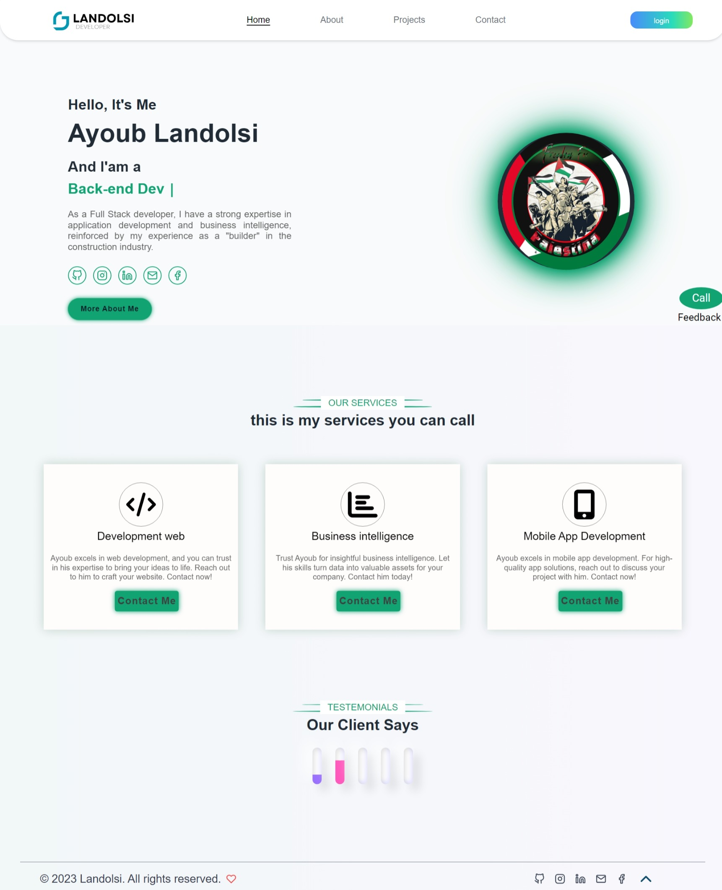
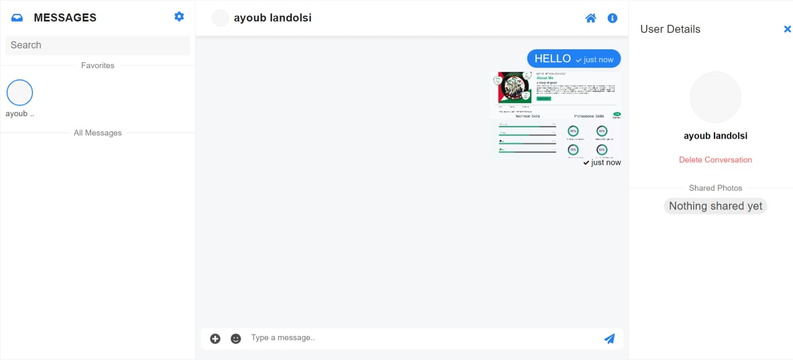
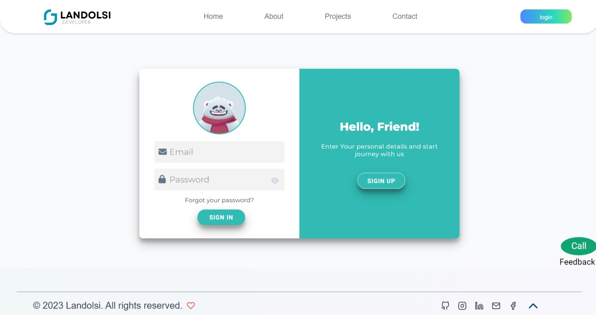
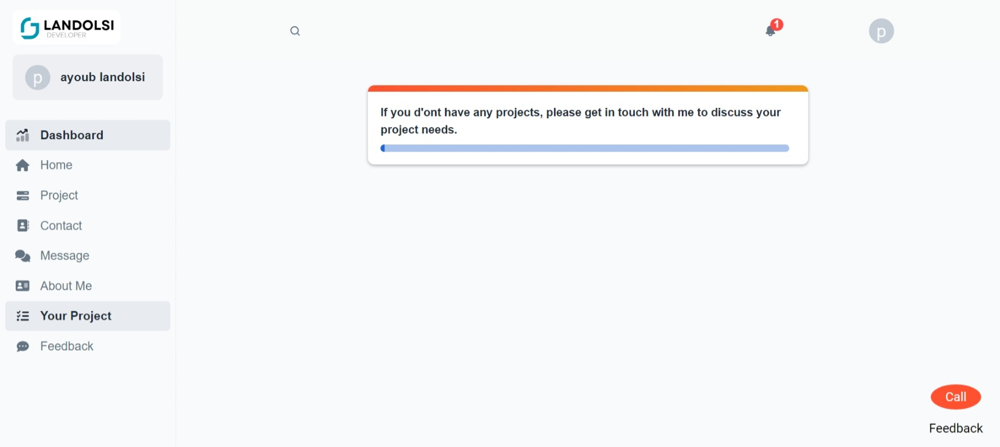
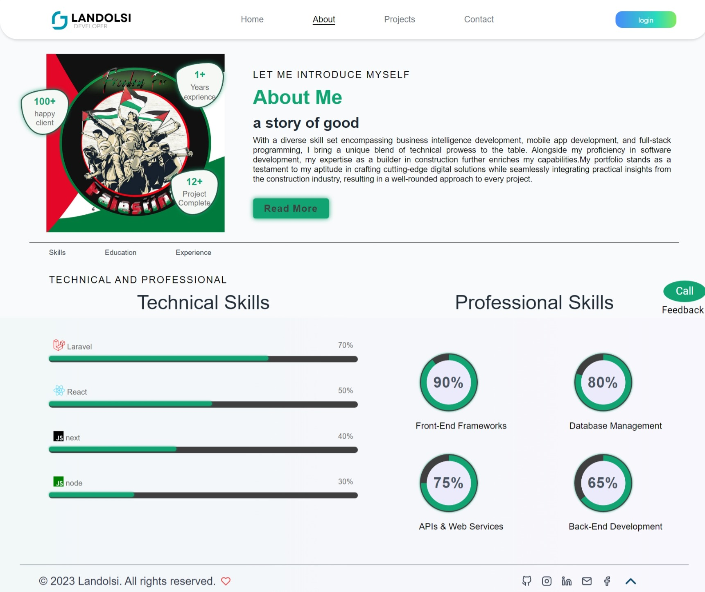
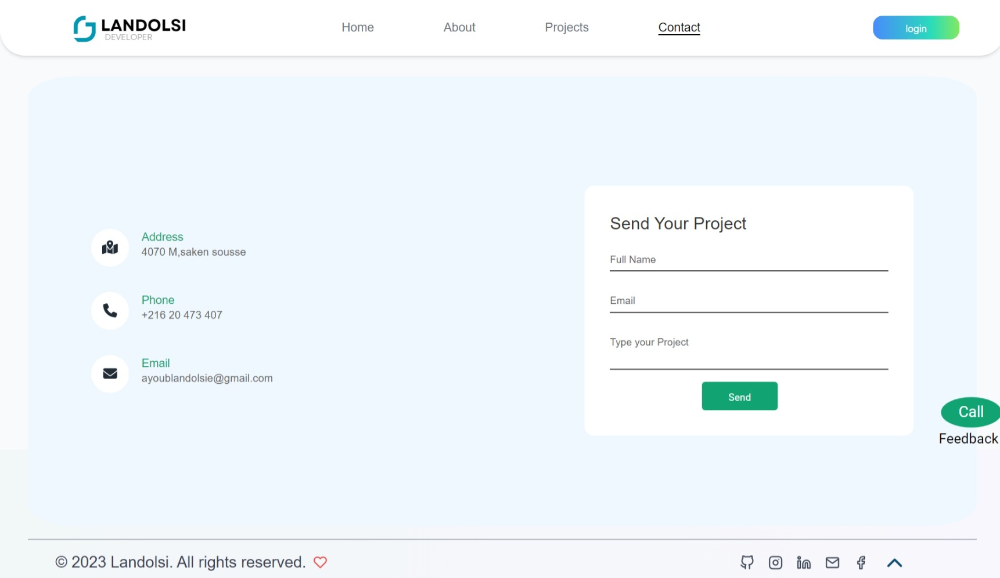
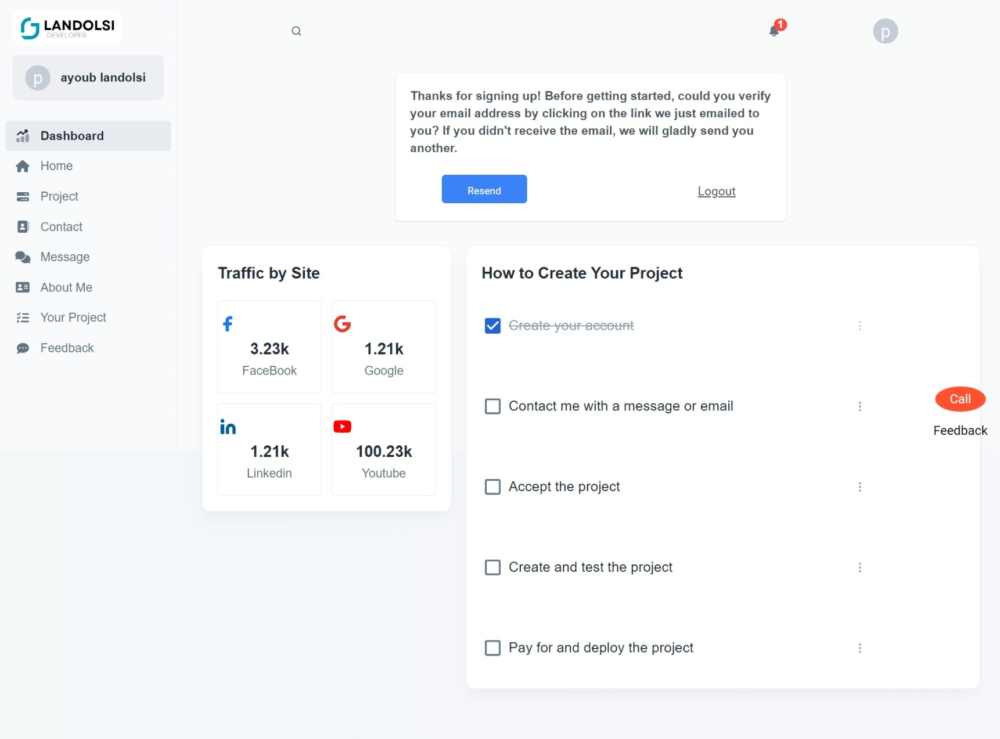
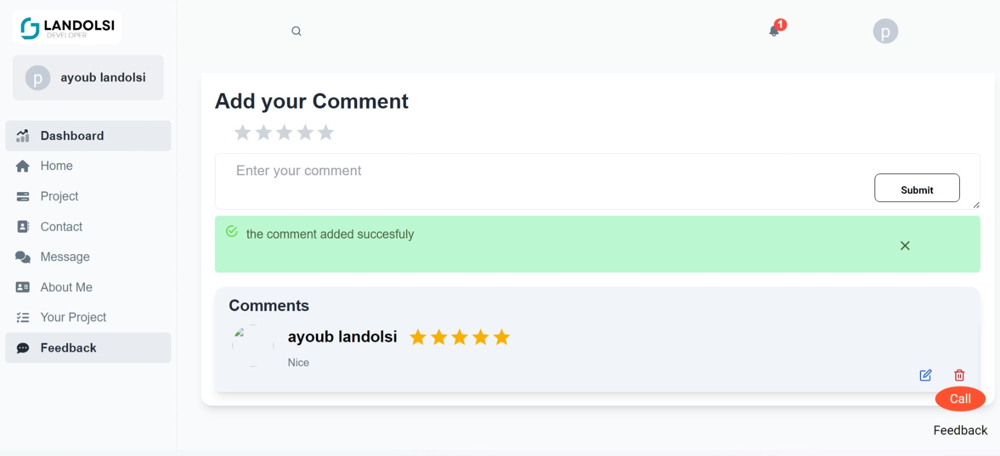
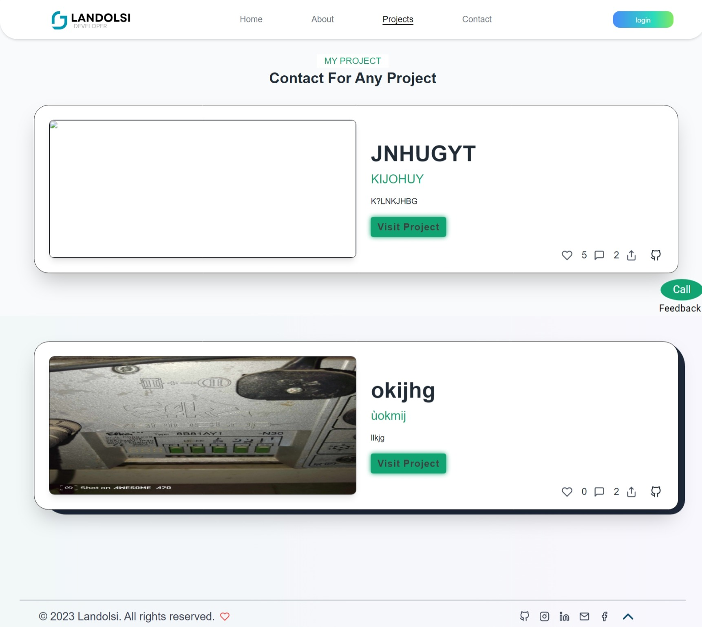

# Portfolio_BackEnd

## Important Notice

This repository is protected. You are not allowed to download, use, or distribute the code in this repository without explicit permission from the repository owner. Please contact me at ayoublandolsie@gmail.com if you wish to use or contribute to this project.

  
  
  

  
  
  

  
  
  

## Description

This project is a full-stack web application with a React frontend and a Laravel backend. The application allows users to create accounts, manage projects, provide feedback, and interact through a chat system similar to Messenger. Users can also comment on and like projects, and upload photos as part of their profile or project content.

## Features

### Frontend (React)
- **User Authentication**: Users can sign up, log in, and manage their accounts.
- **Project Management**: Users can create, edit, and view projects.
- **Feedback System**: Users can submit feedback on projects.
- **Comments and Likes**: Users can comment on and like projects.
- **Chat System**: Real-time chat functionality similar to Messenger.
- **Photo Upload**: Users can upload photos for their profile and projects.
- **Responsive Design**: The frontend is fully responsive and works on all devices.
- **Multi-Language Support**: The frontend supports multiple languages.

### Backend (Laravel)
- **API Endpoints**:
  - **User Authentication**: Login, register, password reset.
  - **Project Management**: Create, update, delete, and retrieve projects.
  - **Feedback**: Submit and view feedback.
  - **Comments and Likes**: Post comments, like projects, retrieve comments and likes.
  - **Chat System**: Send and receive messages in real-time.
  - **Photo Handling**: Upload, retrieve, and manage photos.
  - **Email Sending**: Send emails for notifications, confirmations, etc.

## Tech Stack

- **Frontend**: React, React Router, Axios, Tailwind CSS, Context API
- **Backend**: Laravel, MySQL/PostgreSQL
- **Real-time Communication**: Pusher/Socket.io (for chat)
- **Image Handling**: Laravel Storage, Cloudinary (optional)
- **Email Service**: Laravel Mail, Mailgun/SMTP
- **Build Tool**: Vite.js

